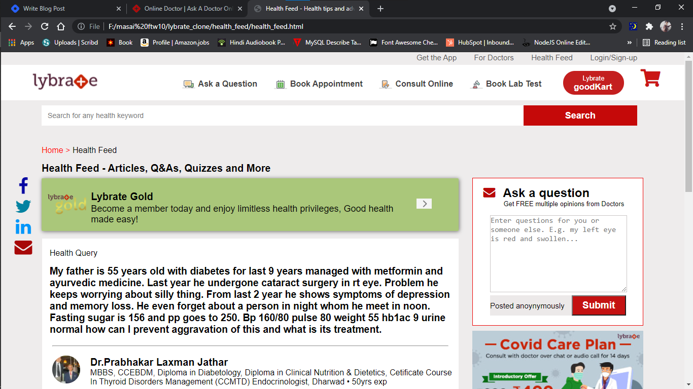
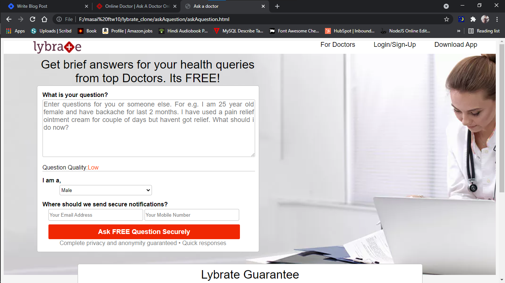

# lybrate-Clone
clone of website lybrate (https://www.lybrate.com/?lpt=NAV)

### welcome to this repo,

as part of unit3 construct week our team ([Harsh Chaturvedi](https://github.com/harshchaturvedi1),  [Sagar Biswas](https://github.com/mrsagar105), [Ankur Anand](https://github.com/ankuranand598),[Deepak Chourasiya](https://github.com/deepak-chaurasiyaa)) was asigned a task to clone the website [Lybrate](https://www.lybrate.com/?lpt=NAV), we have worked whole one week and given our best to clone in the best possible way we can.

### TOOLS AND TECHNOLOGY USED >

- HTML (through ejs templeate engine)
- css
- javascript
- js dom manipulation
- font Awesom icons
- bootstrap (for styling flash mesage)
- Nodejs    
- mongodb atlas (for database)

### Node packages and libraries

- connect-flash      :  0.1.1
- ejs (templeate engine) :  3.1.6
- express-session    :  1.17.2
- mongoose           :  5.11.15
- express(framework) :  4.17.1
- nodemon : 2.0.12

#### WEBSITE CONTENT CLONED>

> here the home, bookApointment, consultOnline, goodCart, login/signup, healthfeed and doctors sections are the part we have majorly focused to clone(create)

### Home Page

### health feed

#### ask question to doctor

### WEBSITE USER FLOW >

the user flow that we tried to maintain is,

> home -> healthfeed -> bookApointment -> askQuestion -> login/signup -> ask question-> forDoctors -> login/signup -> answerQuestion & view submitted responses -> healthfed(to view updated) -> home

also, to explore

> home -> consultOnline -> consultNow
> home -> goodcart ->home

### MESSAGE FROM TEAM >

_we really enjoyed this whole part of clonning and have given our best efforts to bring the BEST thing as POSSIBLE._
